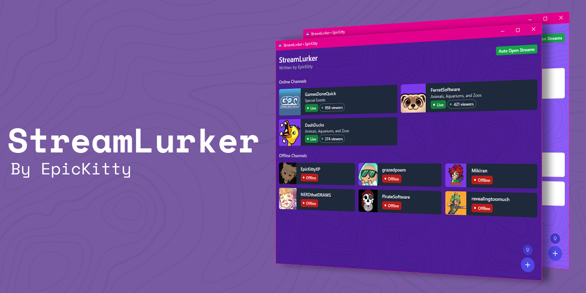

# StreamLurker - A Twitch Lurk Client


[](https://github.com/EpicnessTwo/StreamLurker/actions/workflows/build.yml)
[](https://github.com/EpicnessTwo/StreamLurker/releases)
[](https://github.com/EpicnessTwo/StreamLurker/issues)
[](https://github.com/EpicnessTwo/StreamLurker/issues?q=is%3Aissue+is%3Aclosed)

[](https://ko-fi.com/EpicKitty)

> StreamLurker is currently under active development and may have bugs. Please report issues via the [issues page](https://github.com/EpicnessTwo/StreamLurker/issues).

## About
**StreamLurker** is a lightweight desktop client that shows which of your favourite Twitch streamers are live, with automatic opening of streams if desired. It is designed to be minimal, fast, and easy to use — now powered by **Tauri v2** and **Bun** for blazing-fast performance and native efficiency.

## Features
- Instantly view who's live on your Twitch follow list
- Automatically open streams as they go live
- Customize and manage your list of tracked streamers
- Predictive Go Live Alerts (Alpha)
- Built with Tauri for speed, security, and low resource usage

## Installation

Head to the [releases page](https://github.com/EpicnessTwo/StreamLurker/releases) and download the latest version for your platform:
- Windows (.msi or .exe)
- macOS (.dmg)
- Linux (.AppImage, .deb, or .tar.gz)

No Twitch credentials required — just add your favorite usernames and lurk away.

## Development

### Prerequisites
- [Rust](https://www.rust-lang.org/tools/install)
- [Bun](https://bun.sh)
- [Tauri CLI](https://tauri.app/start/prerequisites/):  
  ```
  cargo install create-tauri-app tauri-cli
  ```

### Setup
1. Clone this repository:
   ```
   git clone https://github.com/EpicnessTwo/StreamLurker.git
   cd StreamLurker
   ```
2. Install dependencies with Bun:
   ```
   bun install
   ```
3. Run the development build:
   ```
   bun run tauri dev
   ```
4. Build a production-ready package:
   ```
   bun run tauri build
   ```

## License
This project is licensed under the MIT License. See the [LICENSE](LICENSE) file for details.

## Contributing
Pull requests are welcome! For large changes, please [open an issue](https://github.com/EpicnessTwo/StreamLurker/issues) to discuss the idea first.

## Credits and Attribution
- Logo by [FlatIcon](https://www.flaticon.com/free-icon/lurker_2041070)

