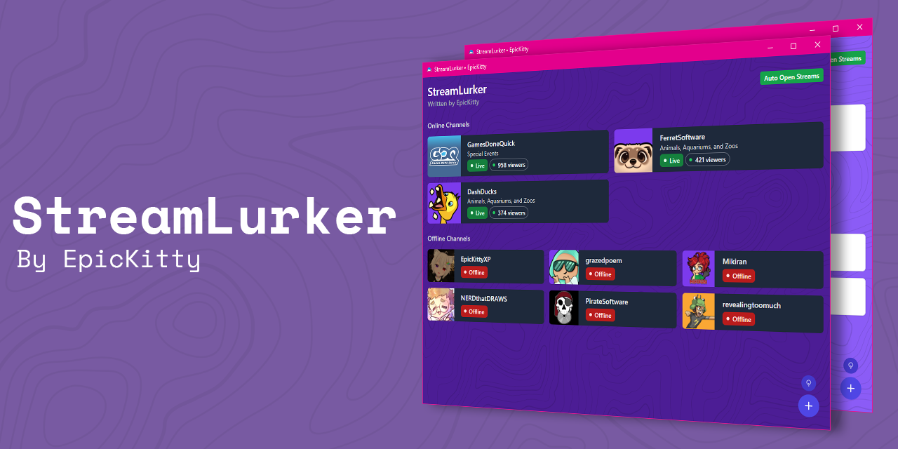

# StreamLurker - A Twitch Lurk Client

> Whilst this client is mostly functional, it is still in development and may have bugs. Please report any bugs you find to the [issues](https://github.com/EpicnessTwo/StreamLurker/issues) page.

## About
StreamLurker is a small client that quickly shows you which of your favourite streamers are live, with the ability to automatically open their streams. It is designed to be lightweight and easy to use.

## Features
- Quickly see which of your favourite streamers are live
- Automatically open streams when they go live
- Customise the list of monitored streamers

## Installation

Navigate to the [releases](https://github.com/EpicnessTwo/StreamLurker/releases) page and download the latest version for your operating system.

## Development

### Prerequisites
- [Node.js](https://nodejs.org/en/) (v12.0.0 or higher)

### Setup
1. Clone the repository
2. Install dependencies with `npm install`
3. Run the application with `npm start`
4. Build the application with `npm run dist`

## License
This project is licensed under the MIT License - see the [LICENSE](LICENSE) file for details.

## Contributing
Pull requests are welcome. For major changes, please open an issue first to discuss what you would like to change.

## Credits and Attribution

 - [FlatIcon](https://www.flaticon.com/free-icon/lurker_2041070) for the logo